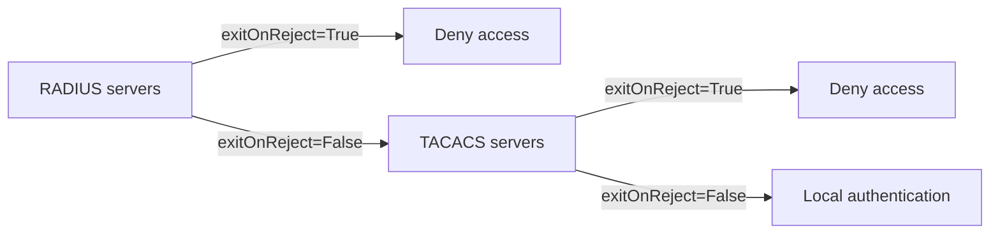

# Authentication Policy

-{}-

-{{ category(resource_name_plural) }}- → -{{ icons.circle(letter=resource_name_acronym, text=resource_name_plural_title) }}-

An `AuthenticationPolicy` defines parameters that apply to logged-in users and to the way authentication is performed on the node. It covers password complexity rules, lockout behavior after failed login attempts, idle timeout, and the order in which authentication methods are attempted (including remote AAA via [ServerGroup](servergroup.md) resources and local authentication).

## Multiple authentication methods

Using external authentication servers enables robust integration with existing permission management systems. Two well-known external authentication protocols are TACACS+ and RADIUS: instead of configuring individual user accounts on each network element, these authentication methods allow centralized user and permission management, as well as logging what a user does for auditing purposes. 

While this has obvious benefits, some network designs may require multiple authentication methods to be attempted. One of the most common use-cases for multiple authentication methods is the so-called "emergency access account".

!!! info "Emergency access accounts"

    If the centralized authentication servers become unreachable or compromised, users can no longer log into the network elements. An emergency access account is a locally configured user account that is not used during regular operation, but is a last resort for gaining access to the network elements.

The `authenticationOrder` property of the `AuthenticationPolicy` determines which authentication methods are attempted, and in what order. For example:

1. First try RADIUS server A
2. Then try TACACS servers B and C
3. Finally, try local user authentication

The `exitOnReject` boolean controls whether to continue to the next method after a rejection. When `exitOnReject` is `True`, a rejection from one authentication method stops the chain and no further methods are tried.

`exitOnReject` should be set to `True` when subsequent authentication methods must be used **only if** the servers in the current [`ServerGroup`](servergroup.md) are unreachable. When it is `False`, methods are tried in order until one accepts the authentication request or the list is exhausted. The following diagram illustrates the behavior when a **local user** 'admin' tries to log in:




## Referenced resources

### [`ServerGroup`](servergroup.md)

An `AuthenticationPolicy` refers to [ServerGroup](servergroup.md) resources via **authenticationOrder.serverGroupOrder**. That field lists [`ServerGroup`](servergroup.md) names in the order they are used for authentication.

## Examples

/// tab | YAML

```yaml
-{{ include_snippet(resource_name) }}-
```

///

/// tab | `kubectl`

```bash
cat << 'EOF' | kubectl apply -f -
-{{ include_snippet(resource_name) }}-
EOF
```

///

## Custom Resource Definition

To browse the Custom Resource Definition go to [crd.eda.dev](https://crd.eda.dev/-{{ resource_name_plural }}-.-{{ app_group }}-/-{{ app_api_version }}-).

-{{ crd_viewer(crd_path, collapsed=False) }}-
