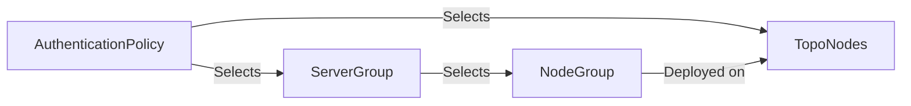

# Server Group

-{}-

-{{ category(resource_name_plural) }}- → -{{ icons.circle(letter=resource_name_acronym, text=resource_name_plural_title) }}-

A `ServerGroup` defines a list of AAA (authentication, authorization, and accounting) servers used for remote authentication and accounting and includes settings for RADIUS and TACACS+ servers. Each `ServerGroup` is limited to servers of a single type: either RADIUS or TACACS+.

!!! info "Server type"

    The **type** field determines the protocol used by all servers in the group (`RADIUS` or `TACACS`). Type-specific options are configured under `radius` (e.g. authentication port, accounting port, retransmit attempts) or `tacacs` (e.g. port, privilege-level authorization).

The `routerKind` field specifies which router is used to reach the AAA servers (`DefaultRouter` or `ManagementRouter`). The node waits for a response from an AAA server according to `timeoutSeconds` before retrying or continuing to the next server in the group.

## Deployment

Each node can use multiple methods for the authentication of users. Some common scenarios are:

- Attempt to authenticate using a local user first. If no local user is found, try authentication using RADIUS
- Local authentication is used only when the TACACS+ authentication servers are unresponsive

A `ServerGroup` is deployed onto nodes where it is used for authentication. Those nodes are determined by [`AuthenticationPolicy`](authenticationpolicy.md) resources via its `nodeSelectors` or `nodes` property: any [`AuthenticationPolicy`](authenticationpolicy.md) that lists a `ServerGroup` by name in `authenticationOrder.serverGroupOrder` will ensure the `ServerGroup` is configured on those nodes. 

The `ServerGroup` also specifies which [`NodeGroup`](nodegroup.md) resources must be deployed on the same set of nodes, using `nodeGroupSelectors` or `nodeGroups` (an explicit list of [`NodeGroup`](nodegroup.md) names).



## Referenced resources

### [`NodeGroup`](nodegroup.md)

Part of the authentication process is assigning a role to a user. This role determines which services the user can use (SSH, gNMI, ...) and which resources the user can read / modify. These authorization rules are determined by a [`NodeGroup`](nodegroup.md).

The `ServerGroup` allows the selection of [`NodeGroup`](nodegroup.md) resources through the `nodeGroups` or `nodeGroupSelectors` property, to ensure that those authorization rules are present on the node even if they are not used by a locally configured `NodeUser`.

## Examples

/// tab | YAML

```yaml
-{{ include_snippet(resource_name) }}-
```

///

/// tab | `kubectl`

```bash
cat << 'EOF' | kubectl apply -f -
-{{ include_snippet(resource_name) }}-
EOF
```

///

## Custom Resource Definition

To browse the Custom Resource Definition go to [crd.eda.dev](https://crd.eda.dev/-{{ resource_name_plural }}-.-{{ app_group }}-/-{{ app_api_version }}-).

-{{ crd_viewer(crd_path, collapsed=False) }}-
