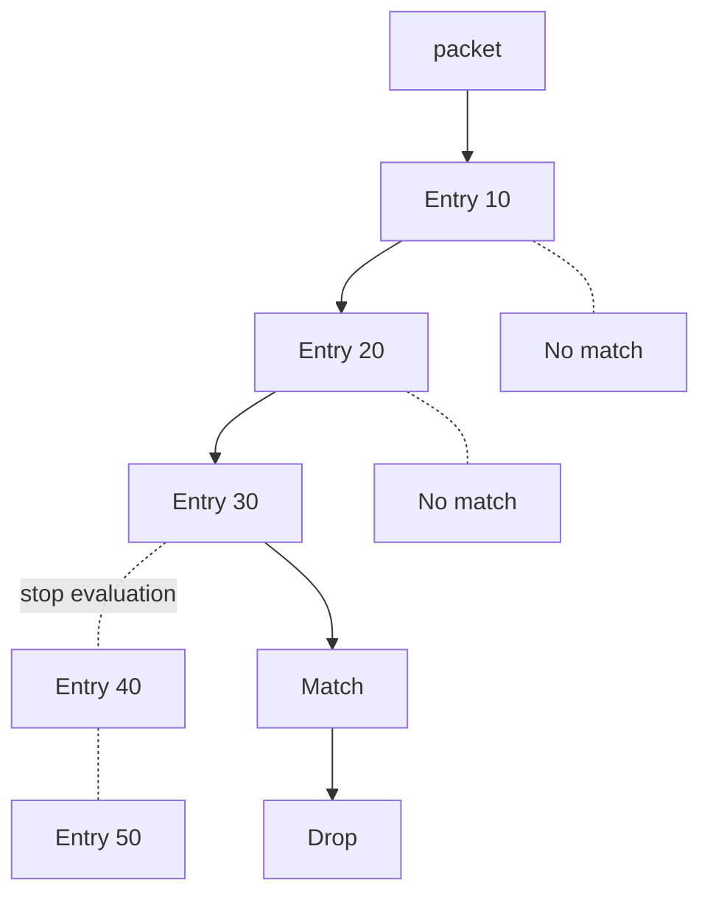

# Filter

-{}-

-{{ category(resource_name_plural ) }}- → -{{ icons.circle(letter=resource_name_acronym, text=resource_name_plural_title) }}-

A `Filter` is an ordered list of filter entries that **match** certain packets and perform an **action** for those packets. Packets can be matched by their source IP, destination IP, source port, destination port, and many others. There are 2 types of filters:

- IP filters that can match based on the IP header of an IP packet
- MAC filters that can match based on the layer 2 (ethernet) header of an ethernet frame

!!! note

    A `Filter` resource is deployed through resources like [`RoutedInterface`](../../../services.eda.nokia.com/docs/resources/routedinterface.md) or [`IRBInterface`](../../../services.eda.nokia.com/docs/resources/irbinterface.md) that determine which sub-interface the `Filter` applies to. For system-wide control plane filters, check out the [`ControlPlaneFilter`](controlplanefilter.md) resource.

The packet is filtered through all filter entries in-order. If there is no match, the packet is evaluated against the next entry and so on. Once a packet matches a particular entry, evaluation of the chain ends and the action specified in the entry is performed on the packet. 



## Dependencies

The `Filter` resource has no dependency on other resources.

## Referenced resources

### [`PrefixSet`](prefixset.md)

In the `ipEntry` context, source and destination prefixes can be entered manually through the `sourcePrefix` and `destinationPrefix` properties. If the entry must execute the same action for source / destination IP addresses in multiple discontiguous subnets, consider using a [`PrefixSet`](prefixset.md) to group those subnets together.

## Examples

/// tab | YAML

```yaml
-{{ include_snippet(resource_name) }}-
```

///

/// tab | `kubectl`

```bash
cat << 'EOF' | kubectl apply -f -
-{{ include_snippet(resource_name) }}-
EOF
```

///

## Custom Resource Definition

To browse the Custom Resource Definition go to [crd.eda.dev](https://crd.eda.dev/-{{ resource_name_plural }}-.-{{ app_group }}-/-{{ app_api_version }}-).

-{{ crd_viewer(crd_path, collapsed=False) }}-
