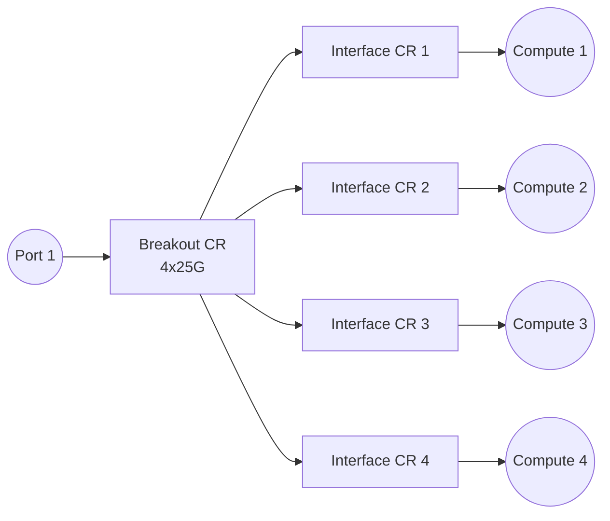

# Interfaces Application

-{}-

| <nbsp> {: .hide-th } |                                         |
| -------------------- |-----------------------------------------|
| **Group/Version**    | -{{ app_group }}-/-{{ app_api_version }}-   |
| **Supported OS**     | -{{ supported_os_versions() }}-  |
| **Catalog**          | [Nokia/catalog/interfaces ][manifest] |
| **Source Code**      | <small>coming soon</small>              |

[//]: # (Note: fill in the hyperlink to the published manifest in the public catalog)
[manifest]: https://docs.eda.dev/

The Interfaces application models physical ports on equipment, and is therefore one of the cornerstones of EDA. It provides the following components:

/// tab | Resources

* [`Breakout`](resources/breakout.md)
* [`Interface`](resources/interface.md)

///

/// tab | Workflows

* [`AnalyzeAlarm`](resources/analyzealarm.md)
* [`CheckInterfaces`](resources/checkinterfaces.md)

///

## [`Interface`](./resources/interface.md) types

The [`Interface`](./resources/interface.md) resource declaratively defines abstracted network interfaces for the range of supported network operating systems and supports three primary interface types:

- [**Standard Interface:**](./resources/interface.md#interface) Individual physical interfaces
- [**LAG (Link Aggregation Group):**](./resources/interface.md#lag) Bundled interfaces operating as a single logical link
- [**Loopback:**](./resources/interface.md#loopback) Virtual interfaces for management and routing purposes

## Breakout ports

On networking equipment especially, physical ports can "break out" into multiple interfaces, through a breakout cable. This special cable splits a physical port with a higher capacity (e.g. 100G) into multiple lower capacity endpoints (e.g. 4 x 25G). Since this breakout cable has one "head" on one end and multiple "arms" on the other end, this cable is also known as an octopus cable.

- A [`Breakout`](resources/breakout.md) resource configures the physical port on the node to support multiple physical endpoints (breakout ports)
- An [`Interface`](resources/interface.md) resource models one end of a physical link, with a unique endpoint

!!! note "Resource creation"

    [`Breakout`](resources/breakout.md) resources do not create derived [`Interface`](resources/interface.md) resources. The [`Interfaces`](resources/interface.md) must be created manually if they are connected to endpoints.