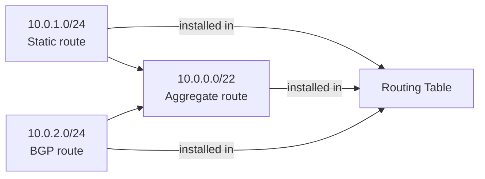

# Aggregate Route

-{}-

-{{ category(resource_name_plural) }}- → -{{ icons.circle(letter=resource_name_acronym, text=resource_name_plural_title) }}-

Aggregate routes are - as the name implies - routes that aggregate one or more active routes into an encompassing prefix. They are used to reduce the number of routes advertised to BGP peers. The following diagram illustrates the concept of aggregate routes:



In the example above `10.0.1.0/24` is a static route, and `10.0.2.0/24` is received via the BGP protocol. Both routes are valid and installed in the same routing table. The aggregate route is also installed in the routing table, as at least one route in subnet `10.0.0.0/22` is installed in the routing table. 

All three routes are advertised to other BGP peers, unless the property `summaryOnly` property is set to `true`: in this case only the aggregate route `10.0.0.0/22` is advertised.

!!! note "Non-matching traffic"

    Traffic towards an IP that matches the aggregate route, but not a more specific route, is blackholed. In our example, the node would attract traffic for destination IP `10.0.3.123`, but would discard the packet when it arrives.

> To set up aggregate routes in the default VRF, use [`DefaultAggregateRoute`](defaultaggregateroute.md) instead.

## Dependencies

To configure this resource, the following resources must exist or be created alongside the `AggregateRoute`

* The [`Router`](../../../services.eda.nokia.com/docs/resources/router.md) in which the static route will be configured

## Referenced resources

### [`Router`](../../../services.eda.nokia.com/docs/resources/router.md)

Aggregate route prefixes configured in the `AggregateRoute` resource are only configured in the VRF of the linked [`Router`](../../../services.eda.nokia.com/docs/resources/router.md) resource. Note that the aggregate route is only installed and becomes active if at least one more specific route installed in the VRF routing table. 

### `TopoNode`

Optionally, a list of nodes can be provided on which the aggregate route is configured. If no nodes are specified, EDA will deploy the aggregate route on **ALL** nodes that the [`Router`](../../../services.eda.nokia.com/docs/resources/router.md) is configured on.

## Examples

/// tab | YAML

```yaml
-{{ include_snippet(resource_name) }}-
```

///

/// tab | `kubectl`

```bash
cat << 'EOF' | kubectl apply -f -
-{{ include_snippet(resource_name) }}-
EOF
```

///

## Custom Resource Definition

To browse the Custom Resource Definition go to [crd.eda.dev](https://crd.eda.dev/-{{ resource_name_plural }}-.-{{ app_group }}-/-{{ app_api_version }}-).

-{{ crd_viewer(crd_path, collapsed=False) }}-
