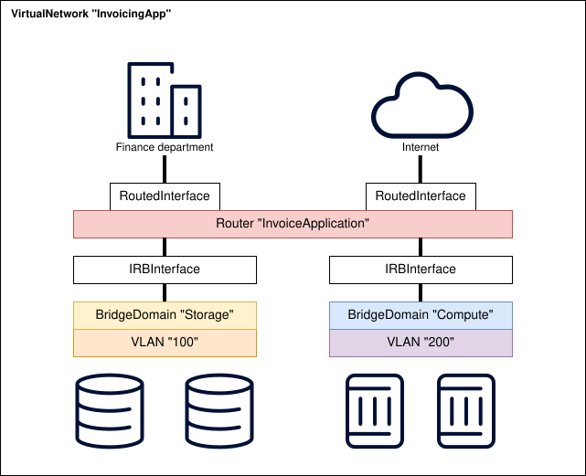

# Services Application

-{}-

| <nbsp> {: .hide-th } |                                         |
| -------------------- |-----------------------------------------|
| **Group/Version**    | -{{ app_group }}-/-{{ app_api_version }}-   |
| **Supported OS**     | -{{ supported_os_versions() }}-  |
| **Catalog**          | [Nokia/catalog/services ][manifest] |
| **Source Code**      | <small>coming soon</small>              |

[//]: # (Note: you should fill in the hyperlink to your published manifest in your public catalog)
[manifest]: https://docs.eda.dev/

The services app is all about virtualized, distributed networking services, which are logical constructs that facilitate connectivity between computes and the world outside of your datacenter. Each service is isolated, meaning that connectivity is restricted to hosts that are connected to that service. Multiple services can be connected to each other, either directly or indirectly.

Before looking at the different types of service constructs that are available in the services app, it's important to talk about the prerequisites for service-based switching and routing, as well as some protocols that will be used extensively throughout this app: EVPN, VxLAN, and MPLS.

## Service routing prerequisites

[Overlay routes](-{{ ref_app_doc('routing', 'index.md') }}-#overlay-routing) are typically (but not exclusively) exchanged through the BGP protocol, and relate to a specific service. An overlay or service route is originated by a service-aware network element to tell their peers:

- Which virtualized services are configured on this node
- Which hosts are directly connected to a service
- Which routes are reachable through a service on this node, for example:
    - A BGP peer directly connected to the virtual router service on this node
    - A static route pointing towards a host IP in the broadcast domain
- Which ports on this node belong to a particular multi-homed [ethernet segment](-{{ ref_app_doc('interfaces', 'interface') }}-)

From now on, the documentation articles for this app assume that a dynamic routing protocol is used for the exchange of service routes. They are created by overlay protocols like EVPN and BGP-IPVPN and exchanged via multi-protocol BGP via the [underlay](-{{ ref_app_doc('routing', 'index.md') }}-#underlay-routing). A full overview of the inner workings of overlay protocols and their capabilities is beyond the scope of this article.

The application provides the following components:

/// tab | Resources

* [`BridgeDomain`](./resources/bridgedomain.md)
* [`BridgeDomainInterconnect`](./resources/bridgedomaininterconnect.md)
* [`BridgeInterface`](./resources/bridgeinterface.md)
* [`DHCPRelay`](./resources/dhcprelay.md)
* [`IRBInterface`](./resources/irbinterface.md)

* [`RoutedInterface`](./resources/routedinterface.md)
* [`Router`](./resources/router.md)
* [`RouterInterconnect`](./resources/routerinterconnect.md)
* [`VirtualNetwork`](./resources/virtualnetwork.md)
* [`VLAN`](./resources/vlan.md)

///

/// tab | Workflows

* [`EdgePing`](./resources/edgeping.md)

///
/// tab | Operators

* [`Network Client Provider`](./resources/networksclientproviderinstance.md)

///

## Use cases

The resources in the services application all interact with each other. Together, they enable connectivity between computes and the WAN. The following sections group these resources together, providing some use cases for each of them.

### Layer 2 virtual services

Layer 2 or bridged communication is ethernet traffic that is switched rather than routed: either the packet being sent has no IP header, or the source and destination IPs live in the same IP subnet. 

Just like a physical **switch**, the [`BridgeDomain`](./resources/bridgedomain.md) service maintains a MAC table, which is distributed over multiple physical network nodes. Usually, the [`BridgeDomain`](./resources/bridgedomain.md) service is only present on nodes that physically connect at least one host to that particular service. All nodes that participate in the [`BridgeDomain`](./resources/bridgedomain.md) communicate together so each node has a complete view of the full MAC table for the service.

/// note | Synonyms for bridge domains 
A [`BridgeDomain`](./resources/bridgedomain.md) service is commonly known as a **MAC-VRF** or **VPLS**.
///

The [`VLAN`](./resources/vlan.md) and [`BridgeInterface`](./resources/bridgeinterface.md) resources are both used to connect **physical interfaces** to a [`BridgeDomain`](./resources/bridgedomain.md). To allow a physical compute node to communicate with multiple [`BridgeDomain`](./resources/bridgedomain.md) services, a VLAN tag is added to an [`Interface`](-{{ ref_app_doc('interfaces', 'interface') }}-). The combination of a physical [`Interface`](-{{ ref_app_doc('interfaces', 'interface') }}-) and a VLAN tag is commonly known as a sub-interface. While both resource types allow the specification of such a VLAN tag, the [`BridgeInterface`](./resources/bridgeinterface.md) operates on a single [`Interface`](-{{ ref_app_doc('interfaces', 'interface') }}-), whereas the [`VLAN`](./resources/vlan.md) configures the VLAN on a set of [`Interfaces`](-{{ ref_app_doc('interfaces', 'interface') }}-), selected through labels.

Use [`BridgeDomain`](./resources/bridgedomain.md) services to facilitate connectivity between computes that have an IP in the same subnet, for example a distributed set of storage nodes. An [`IRBInterface`](./resources/irbinterface.md) may be attached to the service to [route](#layer-3-virtual-services) traffic outside of the subnet.

### Layer 3 virtual services

Layer 3 or routed communication is ethernet traffic for which the destination IP is not part of the same broadcast domain as the source IP. A [`Router`](./resources/router.md) determines the next hop of the packet based on its **routing table**.

A [`Router`](./resources/router.md) service maintains a routing table which is distributed over multiple physical nodes. All nodes that participate in the [`Router`](./resources/router.md) service communicate together so each node has a complete view of the full routing table for the service.

/// note | Synonyms for routers
A [`Router`](./resources/router.md) service is commonly known as an **IP-VRF** or **VPRN**.
///

A [`Router`](./resources/router.md) provides routed connectivity between the physical or virtual interfaces that are connected to it:

- A [`RoutedInterface`](./resources/routedinterface.md) attaches to a physical [`Interface`](-{{ ref_app_doc('interfaces', 'interface') }}-) with a VLAN tag and an IP address
- An [`IRBInterface`](./resources/irbinterface.md) attaches to a virtual [`BridgeDomain`](./resources/bridgedomain.md) with an IP address (called the **gateway** address)

Use [`Router`](./resources/router.md) services to interconnect [layer 2 services](#layer-2-virtual-services) or provide routed connectivity to hosts and other network elements while maintaining isolation from other virtual routers.

### Organizing tenants

The term **tenant** can have different meanings:

- A **customer** that buys connectivity from a vendor may require
    - a couple of colocated racks filled with computes that communicate with each other and the internet
    - private communication between geographically dispersed buildings
- A **team** that uses a part of the company's datacenter to perform their business function
- An **application** deployed by a third party vendor in an on-premises datacenter, such as
    - a payroll application
    - an ERP solution
    - proprietary code repositories

The [`VirtualNetwork`](./resources/virtualnetwork.md) resource groups services like [`BridgeDomains`](./resources/bridgedomain.md) and [`Routers`](./resources/router.md) together in a single parent resource, making it easy for operators to determine which virtualized services belong together.

For example, an invoicing **application** may consist of: 

- A redundant pair of storage computes storing customer data that communicate together through a [`BridgeDomain`](./resources/bridgedomain.md)
- A redundant pair of compute nodes that host a web interface for the finance department to create and retrieve invoices, connected through a different [`BridgeDomain`](./resources/bridgedomain.md)
- A [`Router`](./resources/router.md) that provides connectivity between the compute and storage nodes
- A [`RoutedInterface`](./resources/routedinterface.md) that provides connectivity to the finance department
- Another [`RoutedInterface`](./resources/routedinterface.md) connected to an internet gateway that enables the application to send out automated reminders to customers with overdue payments

<!-- TODO: create light and dark modes -->
<!-- Centers the image -->
<figure markdown="1">

</figure>

### Datacenter interconnect (DCI)

Both [`BridgeDomain`](./resources/bridgedomain.md) and [`Router`](./resources/router.md) services can be extended to multiple datacenters, even through a core network via routers that are not managed by EDA. The simplest way to achieve this is to extend the service domain, creating transport tunnels between any two nodes, regardless of which datacenters they are in.

As the number of nodes in the service domain increases, the number of transport tunnels grows quadratically which can become a problem in highly scaled architectures. To alleviate this, the service domain can be split without compromising the ability to configure stretched layer 2 services. 

For example, an architecture with `N` datacenters can be split into `N` service domains, with a separate core domain. Service tunnels are then "stitched" together by datacenter gateway routers using the [`BridgeDomainInterconnect`](./resources/bridgedomaininterconnect.md) and [`RouterInterconnect`](./resources/routerinterconnect.md) resources.

## Symmetric and Asymmetric routing

Several articles in the documentation may refer to symmetric and/or asymmetric routing. This section aims to provide a basic overview of the differences between the two. Both routing models refer to traffic going from one [`BridgeDomain`](./resources/bridgedomain.md) to another.

### Asymmetric routing

In asymmetric routing, both [`BridgeDomain`](./resources/bridgedomain.md) services should be deployed on both the source leaf (connected to the source host) and the destination leaf for optimal routing. The next-hop is determined through the following steps.

1. The source host `192.168.100.123` sends a packet destined for `10.10.10.10` to the gateway `192.168.100.1/24`, configured on the [`IRBInterface`](./resources/irbinterface.md) on the source leaf
2. The source leaf that receives the packet does a lookup on the [`Router`](./resources/router.md) service that the [`IRBInterface`](./resources/irbinterface.md) is associated with
3. The [`Router`](./resources/router.md) service on the source leaf resolves the destination IP to a subnet (`10.10.10.0/24`) in the target [`BridgeDomain`](./resources/bridgedomain.md) service, also configured on the source leaf
4. The target [`BridgeDomain`](./resources/bridgedomain.md) resolves the destination IP address to a MAC address
    * if the MAC for this IP is not known, the source leaf does an ARP request for the destination IP
    * if the MAC for this IP is known, the source leaf sends the packet through the transport tunnel to the destination leaf
5. The target leaf (where the destination host is connected to) resolves the destination MAC address to an interface, and forwards the packet

This model is called asymmetric because the source leaf performs 3 lookups, while the destination leaf performs only 1. 

/// warning | BridgeDomain deployment

It is important that both the source and destination [`BridgeDomains`](./resources/bridgedomain.md) are deployed on all leafs. If not, the source leaf will send the packet to a (deterministically) random leaf that does have this service, which may not be the leaf that the destination host is connected to, resulting in an extra hop.

///

The asymmetric routing model is simpler to deploy, and scales best if the total number of MAC addresses across **all** [`BridgeDomains`](./resources/bridgedomain.md) is limited. The [`Router`](./resources/router.md) service does not need to be a distributed service.

### Symmetric routing

In symmetric routing, the leaf switch only requires [`BridgeDomain`](./resources/bridgedomain.md) services to be deployed if there is a host directly connected to that switch for that particular service. The next-hop is determined through the following steps.

1. The source host `192.168.100.123` sends a packet destined for `10.10.10.10` to the gateway `192.168.100.1/24`, configured on the [`IRBInterface`](./resources/irbinterface.md) on the source leaf
2. The source leaf that receives the packet does a lookup on the [`Router`](./resources/router.md) service that the [`IRBInterface`](./resources/irbinterface.md) is associated with
3. The [`Router`](./resources/router.md) service on the source leaf resolves the destination IP to an IP route (e.g. `10.10.10.10/32`) that is in turn associated with a transport tunnel
4. The destination leaf receives the packet and does a lookup in the [`Router`](./resources/router.md) that the packet was received for. It resolves the destination IP to a subnet (`10.10.10.0/24`) associated with a [`BridgeDomain`](./resources/bridgedomain.md)
5. The destination leaf does a lookup for the MAC address associated with the destination IP
    * if the MAC for this IP is not known, the destination leaf does an ARP request for the destination IP
    * if the MAC for this IP is known, the destination leaf sends the packet to the locally connected destination host

This model is called symmetric routing because both the source and destination leaf perform 2 lookups. 

The symmetric routing model is more complex to deploy, as it requires both the [`BridgeDomain`](./resources/bridgedomain.md) and [`Router`](./resources/router.md) services to be distributed, but scales better and reduces the amount of broadcast traffic throughout the network.