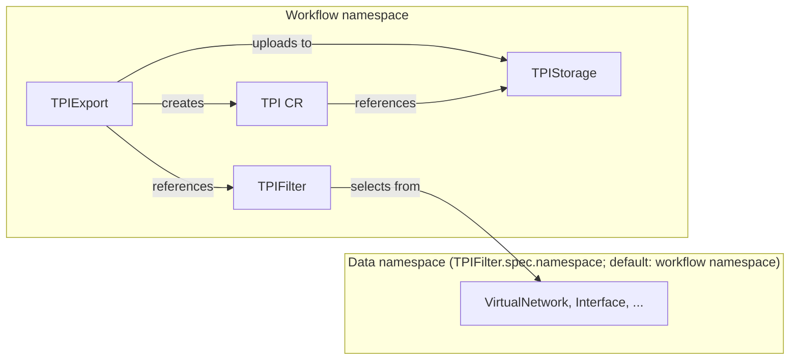
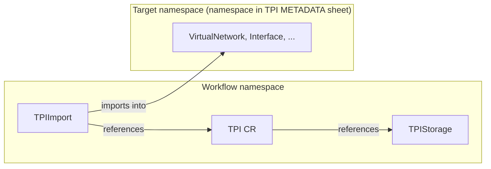

# TPI

-{}-

| <nbsp> {: .hide-th } |                                         |
| -------------------- |-----------------------------------------|
| **Group/Version**    | -{{ app_group }}-/-{{ app_api_version }}-   |
| **Supported OS**     | -{{ supported_os_versions() }}-  |
| **Catalog**          | [Nokia/catalog/tpi ][manifest] |

[//]: # (Note: you should fill in the hyperlink to your published manifest in your public catalog)
[manifest]: https://docs.eda.dev/

Tabular Programming Interface (TPI) is an EDA application for bulk operations on EDA resources using `.xlsx` spreadsheet workbooks as an import/export format. Every resource Kind is represented by a sheet, every field maps to a column, and resources populate the rows. The application provides the following components:

/// tab | Resources

<div class="grid" markdown>
<div markdown>

* [`TPI`](./resources/tpi.md)
* [`TPIFilter`](./resources/tpifilter.md)
* [`TPIStorage`](./resources/tpistorage.md)

</div>
</div>
///

/// tab | Workflows
<div class="grid" markdown>
<div markdown>

* [`TPIExport`](./resources/tpiexport.md)
* [`TPIImport`](./resources/tpiimport.md)
* [`TPIImportDryRun`](./resources/tpiimportdryrun.md)

</div>
</div>
///

## Quick start

/// details | Need a storage back-end for a lab or demo?
    type: tip

The companion **Demo Storage** app from the [EDA Labs catalog](https://github.com/eda-labs/catalog) deploys an in-cluster HTTP server accessible over EDA's `HttpProxy` (see its documentation). Once installed in the EDA Store, step 2 of the Export quick start below
is covered by this `TPIStorage` (update the namespace as needed):

```
-{{ include_yaml('docs/snippets/tpistorage-demo.yaml') }}-
```

/// danger | Not production-hardened -- lab/PoC use only.
///
///

### Export

1. Create a `TPIFilter` in your working namespace, listing the API groups and kinds to export (e.g. `VirtualNetwork` from `services.eda.nokia.com`) and optionally label selectors and column configuration (hiding, ordering, or outright data pruning).
2. Create a `TPIStorage` in your working namespace that points to a storage server you control.
3. Trigger a `TPIExport` workflow referencing the filter, the storage, and a target file path. A `TPI` CR is created automatically and the file is uploaded to the server.
4. Download the TPI spreadsheet from the storage server or from the workflow artifact.

### Edit and import

1. Edit the spreadsheet, fill in the `action` column (`add`, `update`, or `delete`) on a row and save the file.
2. Upload the modified file to the storage server defined by your `TPIStorage`.
3. *(Optional)* If the uploaded filename differs from the exported one, create a matching `TPI` CR pointing to the new file.
4. Trigger a `TPIImportDryRun` workflow for the `TPI` CR. Review the resulting dry run transaction and any validation errors reported in the workflow status.
5. If the dry run looks correct, trigger `TPIImport` for the same `TPI` to apply the changes.
6. *(Optional)* Enable the `exportMaster` option on `TPIImport` to automatically chain a `TPIExport` after a successful import, producing an updated master TPI that reflects the new cluster state.

## Working with the TPI

### Spreadsheet tips

- **Row order does not matter.** Rows are linked by primary key values, not position. Feel free to sort or reorder rows.
- **Fill primary key columns on every row.** Yellow-highlighted cells identify which columns are primary keys for the active context. Rows missing primary keys will fail validation on import.
- **Use the context drop-down first.** Setting the context before filling data lets the conditional formatting immediately flag cells that do not belong to that context.
- **Red cells need attention before import.** A red cell means data was entered in a column that does not belong to the row's context. Clear the value or correct the context.
- **Empty cells are ignored on import.** You do not need to clear optional fields; leaving them blank omits the property from the resulting resource.
- **Check the METADATA sheet before importing.** The `namespace` field determines which Kubernetes namespace all resources will be created in. The sheet also records `tpi-app-version` and `eda-version` for traceability.

### Import dry run

There are two available workflows to import a TPI: `TPIImport` and `TPIImportDryRun`. 
The dedicated `TPIImportDryRun` workflow can be used by users without commit permissions.
When RBAC separation isn't required `TPIImport` can be used with the inline `dryRun` flag. 


1. Trigger a `TPIImport` with `dryRun` enabled. Review the resulting transaction and workflow status.
2. Once satisfied, **duplicate the workflow** using the EDA UI duplicate action, flip `dryRun` off, and submit. The commit runs immediately with the same parameters.

/// note

The `TPIImportDryRun` is a separate CRD (distinct GVK) from `TPIImport`. This separation is intentional. See [RBAC considerations](#rbac-considerations).
///


## Namespace considerations

All TPI CRDs are namespace-scoped. Understanding which resource must live in which namespace is key to a working setup.

### Export

The `TPIExport` workflow and the `TPIFilter` and `TPIStorage` it references must all reside in the **same namespace** -- the workflow namespace. Both references are optional: without a `TPIFilter`, all API resources available to the user are exported; without a `TPIStorage`, the produced TPI is only available as a workflow artifact.

The objects to export, however, may come from a **different namespace**: when `TPIFilter.spec.namespace` is set, it overrides the source namespace for data collection; otherwise the workflow namespace is used.

When a `TPIStorage` is configured, the workflow also creates a `TPI` CR in the workflow namespace pointing at the uploaded file, ready to be consumed by an import workflow.



### Import

The `TPIImport` (or `TPIImportDryRun`) workflow and the `TPI` CR it references must be in the **same namespace**. The `TPI` CR in turn references a `TPIStorage`, which must also be in the same namespace.

The **target namespace for the imported objects** is read from the `namespace` field in the TPI METADATA sheet -- it is embedded in the Excel file at export time and is independent of the workflow namespace. Objects are deployed into that namespace regardless of where the workflow runs. This value is not exposed directly in the workflow status, but it can be determined in two ways: by opening the TPI file and checking the METADATA sheet, or by inspecting the transaction that the workflow generates -- the created, updated, or deleted objects in that transaction carry the target namespace.

When `TPIImport.spec.exportMaster` is configured, it must reference a `TPIFilter` -- this is required, not optional. The chained master export then validates that the effective filter namespace (`TPIFilter.spec.namespace` if set, otherwise workflow namespace) matches the namespace from the imported TPI METADATA sheet. If they differ, the master export is rejected.



## RBAC considerations

EDA enforces access control based on GVK (Group/Version/Kind) and namespace. Because each TPI element (objects and actions) is its own CRD, administrators can assign fine-grained permissions per role.

| Role | Typical access |
|---------|----------------|
| **Admin** | `TPIFilter` (control which resource types and columns are exported); `TPIStorage` (configure the TPI file server) |
| **Planner** | `TPIExport` (produce TPIs), `TPIImportDryRun` (precheck a work order), `TPI` (manage file references and proposed changes) |
| **Operator** | `TPIExport` (capture current cluster state), `TPIImport` (commit a prechecked work order) |

In customer deployments, the Planner and Operator roles are often held by the same individual; if no precheck/handover boundary is needed, grant both `TPIImportDryRun` and `TPIImport` to the same principal.

Key implications:

- **Controlling data provenance.** Access to `TPIFilter` and `TPIStorage` is the Admin's lever for deciding what gets exported and where it is stored. Access to `TPI` is the Planner's lever for deciding which proposed change is staged for review.
- **Separating preview from commit (Planner / Operator).** `TPIImportDryRun` and `TPIImport` are distinct GVKs. The Planner can be granted `TPIImportDryRun` to precheck a work order without being able to commit it; the Operator then commits via `TPIImport`.
- **Namespace scoping.** All CRDs are namespace-scoped, so permissions can be further restricted per namespace.

## Troubleshooting

### TPI is corrupted

If the spreadsheet editor reports the TPI is corrupted, disable styling on the referenced [`TPIFilter`](./resources/tpifilter.md) (`spec.debug.disableStyling`).
Open a support case and include:

- The original TPI
- The TPI that was repaired by the spreadsheet editor

### TPI is unavailable

The `TPI` controller periodically downloads the TPI file from its `TPIStorage` endpoint via HTTP. If the download succeeds, `.status.available` is set to `true`; if it fails (network error, 4xx/5xx response, missing file), `.status.available` is set to `false`. The `Ready` condition mirrors this value.

**Reconciliation triggers.** The controller reconciles a `TPI` resource in three situations:

1. **Spec changes** — any modification to the `TPI` `.spec` (generation change) triggers an immediate reconciliation.
2. **Referenced TPIStorage spec changes** — when the referenced `TPIStorage` spec changes, all `TPI` resources in the same namespace that reference it are requeued.
3. **Heartbeat** — the controller re-checks the file periodically based on `spec.heartbeatInterval` (default: `10m`).

**What to check:**

- **TPIStorage reachability**: verify the referenced `TPIStorage` has `.status.reachable=true`.
- **File path**: confirm the `TPI` `.spec.path` is correct and the file exists on storage.
- **Credentials**: if the `TPIStorage` uses HTTP Basic auth or mTLS, ensure the credentials are valid and the referenced secrets exist.

**How to force a re-check.** Update the `TPI` spec to trigger a new generation and immediate reconciliation — for example, change `spec.heartbeatInterval` to a different value. This causes the controller to re-download the file and update `.status.available` without waiting for the next heartbeat.

**Download failures can trigger a TPIStorage re-check.** When a TPI download fails in a way that challenges the current `TPIStorage.status.reachable` result, the TPI controller immediately wakes up the TPIStorage controller for the associated storage instead of waiting for the next heartbeat. This includes:

- low-level network failures (for example TCP connection refused or DNS resolution failure);
- transport/TLS failures during the request;
- authentication failures (`401`/`403`).

Path-level failures such as `404 Not Found` do not trigger a storage wake-up because they indicate the file path is wrong, not that the storage endpoint became unreachable.

### Storage is reachable but TPI is unavailable

The storage endpoint is responding to `HEAD` requests at its root path, but the TPI controller cannot download the specific TPI file. This is the most common drift scenario.

**Likely causes:**

1. **Wrong file path.** The `TPI` `.spec.path` does not match the actual file location on the server. Check for typos, case sensitivity, or path separator differences. Inspect `.status.url` to see the URL accessed by the TPI.
2. **File does not exist.** The TPI file was deleted or never uploaded to the storage. Re-upload the file and verify the path is correct.
3. **Permissions differ per path.** Some storage servers grant access to the root but restrict individual file paths. If the server uses per-file access controls, verify the credentials have read access to the TPI file path specifically.
4. **Server response code.** The TPI controller treats any non-`200` response from a `GET` request as unavailable.

**Recommended steps:**

1. Verify the TPI file exists at `<storage root>/<spec.path>` by downloading it manually (e.g., `curl`) using the URL computed by the TPI (`.status.url`).
2. If the file exists and the URL is correct, check storage access controls and the HTTP server configuration.

### Storage is unreachable but TPI is available

The `.status.reachable` field reflects the result of the `tpi-manager`'s last periodic `HEAD` request to the storage root URL. The check runs at the interval configured in `spec.heartbeatInterval` (default: 10 minutes), and is intentionally lightweight: it probes the storage *root path*, not any individual TPI file.

`TPI.status.available` indicates whether the TPI file itself can be downloaded (via HTTP `GET`), whereas `TPIStorage.status.reachable` reflects a `HEAD` request against the storage root URL. `reachable=false` is set when the `HEAD` request fails at the network or transport level (which includes mTLS client authentication failures), or when it returns `401`/`403`. A few situations can still produce `reachable=false` while TPI downloads succeed:

1. **Root-path authentication differs from file-path authentication.** The storage root can reject `HEAD` with `401` or `403` while specific file URLs are still downloadable.
2. **The network issue was transient.** The last storage heartbeat may have failed while a later TPI download succeeded.
3. **The server does not support HEAD requests on the root path.**

**Recommendation.** Configure the TPI server so the root path (or `spec.rootPath`) accepts `HEAD`, and ensure its authentication policy matches the file paths used by TPI. If the server cannot be changed, treat `TPI.status.available` as the stronger signal for file-level reachability.

### Import fails despite `available=true`

`TPI.status.available=true` means the TPI controller can download the file from storage; it does **not** mean the file content is valid for import, nor that the workflow job's network can reach storage.

**Content-level errors.** If the workflow reports content-level errors (wrong format, schema violations, missing primary keys, etc.) while the TPI is marked as available, the file itself is reachable but its content has issues. Use the workflow error details to diagnose and fix the file.

**Network or download errors from the workflow job.** The TPI controller runs inside the `tpi-manager` pod, while import workflows run as separate Kubernetes jobs. If the controller can reach the storage but the workflow job cannot:

1. **Force reconciliation**: update the `TPI` spec (e.g., change `spec.heartbeatInterval` or `spec.path`) to trigger a new generation. This causes the controller to re-download the file and refresh `.status.available`.
2. **If drift persists**, investigate platform differences between the operator pod and the workflow job: different worker nodes, DNS resolution discrepancies, `NetworkPolicy` rules blocking egress from the job namespace, or proxy configuration differences.
