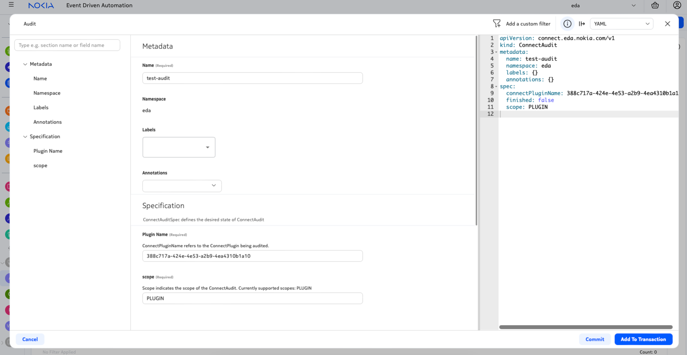

# Audit

## Overview

The EDA Cloud Connect Plugins are listening to or directly interacting with the cloud platforms they manage. Sometimes this connection can be broken temporarily or be out of sync. To automatically fix these _out of sync_ events `Audit` can be ran on the Plugin.

An Audit can be launched through the UI, by navigating to _System Administration_->_Connect_->_Audit_.


As an alternative, you can also create an `Audit` resource in the Kubernetes cluster of EDA with the following content:

/// tab | YAML Resource
```yaml
--8<-- "docs/connect/resources/connect-audit.yaml"
```
///
/// tab | `kubectl apply` command
```bash
kubectl apply -f - <<EOF
--8<-- "docs/connect/resources/connect-audit.yaml"
EOF
```
///

## Audit Result

An `Audit` runs out of band inside the `Plugin` (ie VMWare or OpenShift Plugin). This process can be followed using the _.status.state_ field, which will progress from _Scheduled_ to _InProgress_ to _Finished_.
Once the `Audit` is finished, the _spec.finished_ field will be true.

An example output is given below:
```yaml
status:
  endTime: "2024-12-16T13:37:56Z"
  enqueueTime: "2024-12-16T13:37:56Z"
  outcome: Success
  results:
  - auditType: ConnectPluginAudit
    foundDiscrepancies:
    - connectResourceKind: BridgeDomain
      connectResourceName: 4030b313-60c5-4256-8135-57833913ce67
      outcome: Success
      pluginResourceKind: vlan on Distributed Virtual Portgroup
      type: Missing
    - connectResourceKind: Vlan
      connectResourceName: 33b01228-b522-434c-b099-26ff69ec57c4
      outcome: Success
      pluginResourceKind: vlan on Distributed Virtual Portgroup
      type: Dangling
    - connectResourceKind: Vlan
      connectResourceName: 0c7f00d6-5d0a-469f-85a7-6733e457df8c
      outcome: Success
      pluginResourceKind: vlan on Distributed Virtual Portgroup
      type: Missing
    outcome: Success
    state: Finished
  state: Finished
  totalNumberOfDiscrepancies: 3
  totalNumberOfSuccessfulDiscrepancies: 3
```

An `Audit` Status consists of one or more results, each one referencing a different part of the `Audit`. In case of _PLUGIN_ `Audit` the only stage is the `Plugin` auditing against EDA, so typically there will be only one Result.
The Result has an _AuditType_ to indicate the stage of the `Audit`, as well as an _outcome_. The _outcome_ is _Success_ if the `Audit` was able to correct any found discrepancies.

If there are any discrepancies found, they are listed in the _foundDiscrepancies_ list, detailing what resources where involved and what the taken action is. _Dangling_ resources are resources left in EDA that are not available in the `Plugin` environment, while _missing_ resources are the opposite. Finally _Misconfigured_ resources are available in both environments, but have one or more misconfigured fields.

Finally, a count is provided of the _totalNumberOfDiscrepancies_ as well as successfully and failed fixes.

