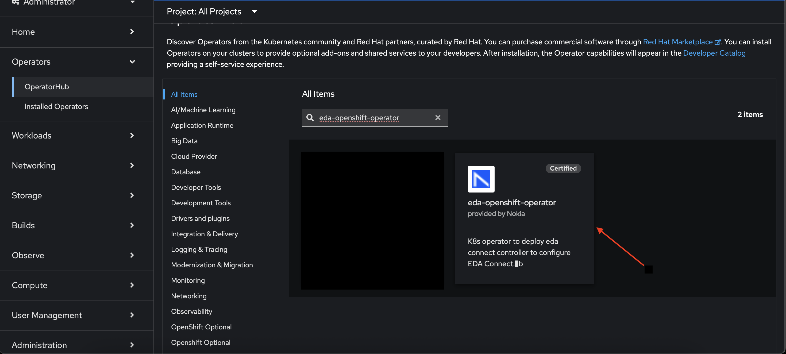
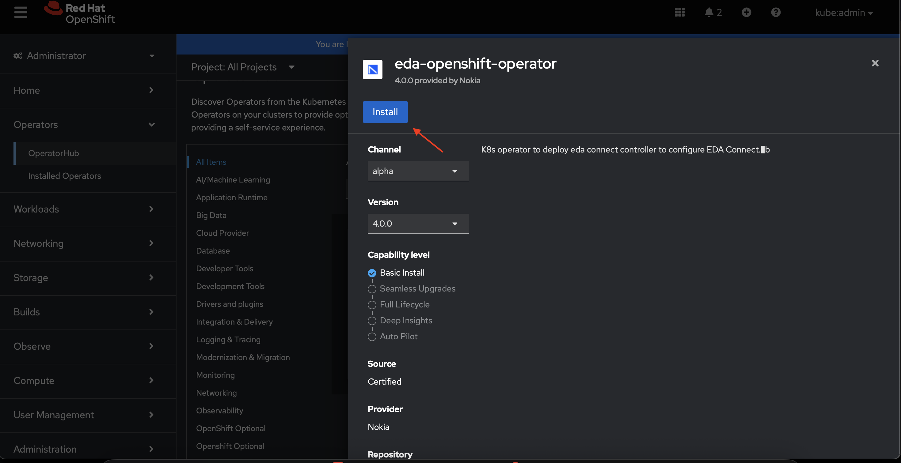
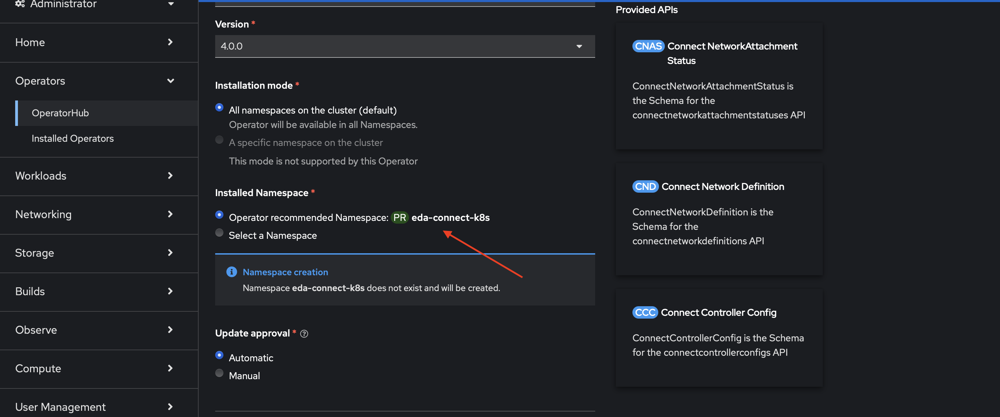

# Kubernetes Plugin OLM Installation

This guide provides step-by-step instructions for installing the EDA Connect Kubernetes plugin using Red Hat Operator Lifecycle Manager (OLM).

/// warning
Before proceeding with this installation method, ensure you have completed all the prerequisites and preparation steps described in
the [Kubernetes Plugin Installation](kubernetes-plugin-installation.md) guide.
///

## Prerequisites

* All prerequisites from the [Kubernetes Plugin Installation](kubernetes-plugin-installation.md) guide must be met
* EDA Kubernetes preparation steps (Service Account and Token) must be completed
* OLM enabled on your OpenShift cluster
* Access to the OpenShift cluster console

## Installation Steps

### Step 1: Install the EDA OpenShift Operator through OLM

Install the operator using the OpenShift console:

1. Log in to your OpenShift cluster console.

2. From the main menu, navigate to **Operators → OperatorHub**.

   /// details | OperatorHub navigation
   
   ///

3. Type `eda-openshift-operator` in the **All Items - Filter by keyword** filter/search box.
   

4. Select the **EDA OpenShift Operator** tile when it displays. The EDA OpenShift Operator page displays.

5. Click **Install**.
   

6. Enter the namespace where the OLM should install the EDA OpenShift Operator on the OpenShift cluster. The default namespace is
   `eda-connect-k8s-controller`.
   

7. Scroll down and click **Install**.

### Step 2: Configure a Pull Secret for the Controller Image

If the EDA Connect OpenShift Plugin Controller image is hosted in a registry that requires authentication, create a Kubernetes secret for OpenShift to
pull the image:

```bash
export PULL_TOKEN=<PULL_TOKEN>
kubectl create secret docker-registry eda-k8s-image-secret \
  --docker-server=ghcr.io/nokia-eda/eda-connect-k8s-controller \
  --docker-username=nokia-eda-bot \
  --docker-password=${PULL_TOKEN} \
  -n eda-connect-k8s-controller
```

/// details | Getting the pull token
    type: info

The pull token can be retrieved from your EDA deployment. See the [Get the Pull Token](kubernetes-plugin-installation.md#get-the-pull-token) section
in the main installation guide for detailed instructions.
///

### Step 3: Create Controller Container Environment Secret

Create a `openshift-eda-connect-k8s-controller-env-secret.yaml` file with the following content and update the fields as appropriate:

/// tab | YAML Resource

```yaml
--8<-- "docs/connect/resources/openshift-eda-connect-k8s-controller-env-secret.yaml"
```

///
/// tab | `kubectl apply` command

```bash
kubectl apply -f - <<EOF
--8<-- "docs/connect/resources/openshift-eda-connect-k8s-controller-env-secret.yaml"
EOF
```

///

#### Configuration Parameters

The environment secret requires the following configuration values:

**`CONNECT_HOST`**
: The URL to reach the EDA Kubernetes cluster API.

**`CONNECT_USERNAME`**
: The service account name created in the [Create a Service Account](kubernetes-plugin-installation.md#create-a-service-account) section.

**`CONNECT_PASSWORD`**
: The long-lived token created in the [Create a Service Account Token](kubernetes-plugin-installation.md#create-a-service-account-token) section.

### Step 4: Create EDA Connect K8s Controller Config

Create a `eda-connect-k8s-controller-config-cr.yaml` file with the following content and update the fields as appropriate:

/// tab | YAML Resource

```yaml
--8<-- "docs/connect/resources/eda-connect-k8s-controller-config-cr.yaml"
```

///
/// tab | `kubectl apply` command

```bash
kubectl apply -f - <<EOF
--8<-- "docs/connect/resources/eda-connect-k8s-controller-config-cr.yaml"
EOF
```

///

#### Configuration Parameters

The controller config requires the following values:

**`connectPluginName`**
: A unique name for the plugin within your EDA environment.

/// warning | Plugin Name Requirements
The plugin name must comply with the regex check of `'([A-Za-z0-9][-A-Za-z0-9_.]*)?[A-Za-z0-9]'` and can only contain alphanumerical
characters and `.`, `_` and `-`. It must start with an alphanumerical character, and have a length of 63 characters or fewer.
///

**`heartBeat`**
: The interval in seconds at which the plugin should send heartbeats. Values between 10-30 are recommended.

**`edaNamespace`**
: The namespace in EDA containing the fabric and resources (different from the `eda-system` namespace).

/// details | EDA Namespace
    type: warning
The EDA Namespace is the namespace in EDA where the fabric is configured. This is different from the `eda-system` namespace used for EDA system components.
///

**`skipTLSVerify`**
: Can be enabled to disable server TLS certificate verification when connecting to the EDA Kubernetes cluster (not recommended for production).

**`tlsCertificateData`**
: When certificate validation is enabled, this property can contain the certificate information of the EDA Kubernetes cluster. This is only needed if
certificate validation is enabled and if the EDA Kubernetes certificate has not been signed by a trusted authority.

**`tlsEnabled`**
: Should always be true to ensure TLS is used to secure the communication with the EDA Kubernetes cluster.

## Post-Installation Verification

After deployment, verify the installation was successful using the steps described in
the [Post-Installation Verification](kubernetes-plugin-installation.md#post-installation-verification) section of the main installation guide.

/// warning | Controller namespace
When verifying the controller pod, use the namespace where you installed the EDA OpenShift Operator instead of `eda-connect-k8s-controller`.
///
