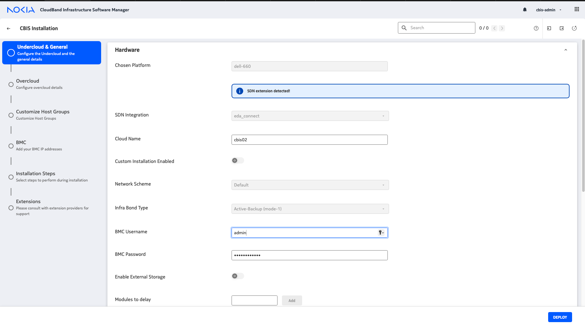

# Installation with the CBIS extension

## Overview

Use this procedure to install the CBIS extension for the ML2 plugin.

The EDA ML2 plugin creates a `ConnectPlugin` within the Connect Service using the name of the CBIS Cloud deployment, as provisioned at installation time. Take care that no ConnectPlugin exists with that name before the CBIS deployment.

## Preparation

### Create a Service Account

The EDA Connect OpenStack Plugin uses a `ServiceAccount` in the EDA Kubernetes cluster to create the necessary resources in the EDA cluster for the integration to properly work.

To create a service account in the EDA Kubernetes cluster, the following resource can be used.

//// details | Service Account and Cluster Role Binding manifest
    type: note
This service account must be created in the `eda-system` namespace.

/// tab | YAML Resource

```yaml
--8<-- "docs/connect/resources/openstack-controller-sa-crb.yaml"
```

///
/// tab | `kubectl apply` command

```bash
kubectl apply -f - <<EOF
--8<-- "docs/connect/resources/openstack-controller-sa-crb.yaml"
EOF
```

///
////

### Create a Service Account Token

From the above Service Account, we need to create a Service Account Token which can be used by the plugin to connect to the EDA Kubernetes cluster. This can be done with the below manifest, which should be applied on the EDA Kubernetes cluster.

//// details | Service Account Token Manifest
    type: note

/// tab | YAML Resource

```yaml
--8<-- "docs/connect/resources/openstack-service-account-token.yaml"
```

///

/// tab | `kubectl apply` command

```bash
kubectl apply -f - <<EOF
--8<-- "docs/connect/resources/openstack-service-account-token.yaml"
EOF
```

///
////

After creating the Service Account Token, you can retrieve the bearer token and ca_cert information using the following commands from the `eda-system` namespace.
This token is what will need to be provided to the plugin during deployment.

```bash
kubectl get secrets/openstack-plugin -n eda-system --template={{.data.token}} | base64 --decode
```

```bash
kubectl get secrets/openstack-plugin -n eda-system --template={{.data.ca_cert}} | base64 --decode
```

//// details | Service Account naming
    type: note
When using the OpenStack plugin in production, it is advised to create a service account per plugin. This way tokens can be revoked on a per-plugin basis.
////

## Procedure

**Step 1** - Extract tarball

Untar the integration tarball and put the extracted content under /root/cbis-extensions inside the CBIS Manager VM.

This creates the `/root/cbis-extensions/eda_connect` folder.

**Step 2** - Refresh the CBIS manager UI

The CBIS Manager should now detect `/root/cbis-extensions/eda_connect` as an SDN extension.



**Step 3** - Add the extension configuration on CBIS manager UI

Choose a unique name for each cloud. If there is another cloud name registered to the same EDA environment, the CBIS deployment fails before undercloud deployment. An error message indicates that a ConnectPlugin exists with the same name.

**Step 4** - Enter the EDA environment details


The Connect OpenStack plugin communicates with EDA using the Kubernetes API.

* EDA Connect service API URI: URI of the Kubernetes API hosting EDA. This can be found in the kubeconfig file for your cluster.
* EDA plugin namespace: The namespace in which the nodes for this cloud are deployed.
* API Bearer Token: The bearer token needed to communicate with the Kubernetes API. This can be extracted from the service account token created in a previous step.
* EDA Server CA Certificate: The self-signed CA certificate of the Kubernetes API. This can be extracted from the service account token created in a previous step.
* Nic-Mapping provisioning: Allow manual creation of nic-mapping entries.

## Updating the Bearer token after installation

When the Bearer token needs to be updated after installation use the following procedure:

**Step 1** - Update the plugin.ini file with the new token

The configuration file can be found at `/etc/neutron/plugins/ml2/ml2_conf_eda_connect.ini`:

```
[ml2_eda_connect]
# Api host of the Connect service
#api_host = None
# Api bearer autentication token
api_token = <new api token>
# CA certificate file
ca_cert_path = /opt/stack/data/eda.pem
# Verify SSL
#verify_ssl = True
# Used as an identifier of the Connect plugin
#plugin_name = openstack
# Plugin heartbeat interval min=3, max=60 to Connect service
# in seconds.
#heartbeat_interval = 10
```

If there is a need to update the certificate info for connecting to the EDA Kubernetes API, replace the file
referred to in the `ca_cert_path`.

**Step 2** - Restart Neutron
