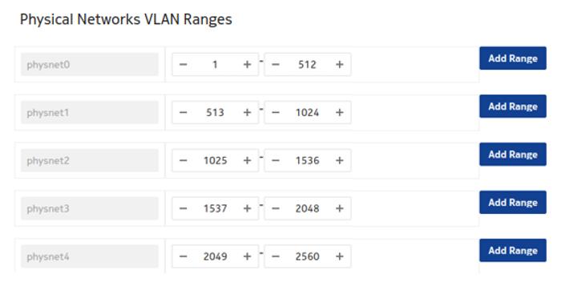

# OpenStack Plugin
<script type="text/javascript" src="https://viewer.diagrams.net/js/viewer-static.min.js" async></script>

## Overview

EDA Cloud Connect integrates with OpenStack to provide fabric level application networks for OpenStack virtual machines. The EDA Cloud Connect integration leverages the OpenStack Neutron architecture to support managing the fabric directly from OpenStack and make the fabric dynamically respond to the networking needs of the application.

It provides the following advantages and capabilities:

* Direct integration into the network management workflow of OpenStack.
* The use of the common ML2 plugins used by enterprise applications and VNFs like OVS, OVS-DPDK and SR-IOV.
* Automatic provisioning of the fabric based on where the virtual machines need the connectivity.
* Support advanced workflows directly through EDA, including for VNF use cases with features like QoS, ACLs, and BGP PE-CE.
* Interconnectivity between different cloud environments, allowing for flexible network configurations.


## Supported Versions

Currently, the OpenStack plugin is only supported with the Nokia CBIS OpenStack distribution.

* CBIS 24

## Architecture

The OpenStack Plugin deploys some components into the OpenStack environment to allow the management of the SR Linux based fabric through OpenStack. Below is an overview of these components:

-{{ diagram(url='nokia-eda/docs/diagrams/openstack-architecture.drawio', title='', page=0) }}-

### The Connect ML2 Plugin

The Connect ML2 plugin is the heart of the integration between OpenStack and EDA. This plugin integrates with OpenStack Neutron and reacts to the creation of Networks, Network Segments and VM ports.

Whenever a network segment is created in OpenStack Neutron, a matching `BridgeDomain` is created in EDA. 

When a VM port is created inside a Neutron Subnet and the VM is started on an OpenStack compute node, the ML2 plugin learns on which compute node the VM is deployed and through the internal topology ensures the necessary `ConnectInterfaces` are configured in EDA.

This information is learned from the L2 Agent extension which stores the Neutron Network to physical interfaces topology in the Neutron database. This information is then provided to the Connect service and together with the LLDP information of the fabric, the Connect service knows which downlinks in the fabrics need to be configured.

### The Connect L2 Agent Extension

The Connect L2 Agent Extensions extend the already existing L2 Agent that is present on every OpenStack compute. These extensions are responsible for mapping the relation between the physical NICs and the different networking constructs setup for the Neutron networks.


## EDA Connect OpenStack Plugin Deployment

Currently only the CBIS platform is supported

[:octicons-arrow-right-24: Installing EDA Connect OpenStack with CBIS](openstack-cbis.md)

## Neutron ML2 Configurations

The EDA Connect OpenStack plugin and the wider Neutron Ml2 framework support a range of configurations that fine tune their behavior.

### Virtualization and network types

The EDA Connect OpenStack ML2 plugin supports the following segmentation types:

 * VLAN: The plugin orchestrates on VLAN neutron networks, programming the EDA Cloud Connect service for fabric-offloaded forwarding.
 * VXLAN and GRE: The plugin will not orchestrate on VXLAN or GRE neutron networks, but it is designed to be tolerant to other Neutron ML2 mechanism drivers.

//// details | VXLAN and GRE management
    type: note
When utilising another ML2 mechanism driver to provision these networks, make sure to create the relevant `VNET` or `BridgeDomain` and `VLAN` resources in EDA, as the plugin will not automatically take care of those. Typically, these will utilise the `untagged` VLAN to communicate between the nodes.

////

The ML2 plugin also supports the following virtualization types:

* VIRTIO
* SRIOV
* DPDK

### Networking Models

The ML2 plugin supports: 

* OpenStack managed networking
* EDA managed networking (TODO See also)

### Forwarding Capabilities

The ML2 plugin supports:

* L2 forwarding, fabric-offloaded
* L3 forwarding
    * Using EDA managed networking model, fabric-offloaded
    * Using OpenStack managed networking model, using virtualized routing on OpenStack controller nodes.

//// details | DVR
    type: note
DVR is currently not supported.
////

### Bonding

The ML2 plugin supports the following CBIS supported bonding models:

* VIRTIO and SRIOV linuxbonds: Active/Backup


//// details | Active/Active VIRTIO/SRIOV support
    type: note
Active/Active for VIRTIO and SRIOV ports is supported by the ML2 plugin, but not by CBIS.
////

//// details | LAG definition in EDA
    type: note
No LAG should be configured for Active/Backup in the `Interfaces` in EDA.
////

* DPDK (OVS bonds): LACP based Active/Active

//// details | Active/Standby DPDK support
    type: warning
Active/Standby is not supported by the ML2 plugin for DPDK ports.
////

//// details | LAG definition in EDA
    type: note
A LAG should be configured for Active/Active in the `Interfaces` in EDA, with corresponding LACP configuration.
////

//// details | DPDK compute wiring
    type: note
As on CBIS SRIOV computes, both the infra bonds and tenant bonds are SRIOV agent managed. The fabric must be wired accordingly; that is, it must have all NICs wired into the fabric.
////

//// details | SRIOV bonding simplification
    type: note
If desired a simplified setup can be created, where only the tenant bond NICs into the fabric. 

| port name    | Number of VFs on port | Enable trust on port | Port to Physnet Mapping | Allow untagged traffic in VGT | Allow infra VLANs in VGT |
|--------------|-----------------------|----------------------|-------------------------|-------------------------------|--------------------------|
| nic_1_port_1 | 45                    | false                | none                    | false                         | false                    |
| nic_1_port_2 | 45                    | false                | none                    | false                         | false                    |
| nic_2_port_1 | 45                    | false                | physnet1                | false                         | false                    |
| nic_2_port_2 | 45                    | false                | physnet2                | false                         | false                    |

////

### Trunking

The network trunk service allows multiple networks to be connected to an instance using a single virtual NIC (vNIC). Multiple networks can be presented to an instance by connecting it to a single port.

For details about the configuration and operation of the network trunk service, see https://docs.openstack.org/neutron/wallaby/admin/config-trunking.html.

Trunking is supported for VRTIO, DPDK and SRIOV.

* For vnic_type=normal ports (VIRTIO/DPDK), trunking is supported through an upstream openvswitch trunk driver.
* For vnic_type=direct ports (SRIOV), trunking is supported by the EDA Connect ML2 plugin trunk driver.

//// details | Trunks with SRIOV ports
    type: warning
Using trunks with SRIOV has some limitations with regard to the upstream OVS trunk model:

* Both parent ports of the trunk and all subports must be created with vnic_type 'direct'.
* To avoid the need for QinQ on switches, trunks for the SRIOV instance must be created with parent port belonging to a flat network (untagged).
* If multiple projects within a deployment must be able to use trunks, the Neutron network above must be created as shared (using the --share attribute).
* When adding subports to a trunk, their segmentation-type must be specified as VLAN and their segmentation-id must be equal to a segmentation-id of the Neutron network that the subport belongs to.
////


### Network VLAN segmentation and VLAN segregation

The ML2 plugin only acts on VLAN Neutron networks. To use VLAN networking, configure 
```provider_network_type = vlan```.

CBIS applies an interconnected bridge model on the OpenStack controller nodes to support multi-physnet host interfaces and be more economical on the physical NIC's usage. As a result, when VLAN networks with overlapping segmentation IDs across physnets are applied, care must be taken that no overlapping segmentation IDs are wired on a host interface. Such a configuration would not be supported by the SR Linux fabric (or any other fabric).

A typical case for this to arise would be if DHCP is enabled on the subnets created on segmentation-ID overlapping networks, as the Neutron DHCP agent on the OpenStack controller nodes would effectively end up in the described conflicting state. This can be avoided by disabling DHCP on the subnets, that is, defining the subnet with dhcp_enable = False. Even when DHCP is not effectively consumed by any VNF deployed in the related networks, the conflict would still occur when DHCP is enabled on the subnets.

If the deployment use cases demand this wiring (for example, some of the deployed VNFs rely on DHCP), the system's VLAN ranges must be segregated per physical network at CBIS installation time. An example configuration is shown below.




## Usage

### OpenStack managed networks

The Connect-based OpenStack solution is fully compatible with OpenStack. The standard API commands for creating networks and subnets remain valid.

When mapping to Connect:

* The network in OpenStack is created within the user's project. If the network is created by an administrator, the administrator can optionally select the project to which the network belongs. For each network segment a `BridgeDomain` will be created.

* Only VLAN-based networks (where segmentation_type == 'vlan') are handled by the EDA ML2 plugin, meaning only VLAN networks are HW-offloaded to the fabric managed by EDA.
Neutron defines the default segmentation type for tenant networks. If you want non-administrators to create their own networks that are offloaded to the EDA fabric, the segmentation type must be set to 'vlan'.
However, if only administrators need this capability, then the segmentation type can be left to its default, since administrators can specify the segmentation type as part of network creation.

* The plugin only supports Layer 2 EDA fabric offloaded networking. When a Layer 3 model is defined in OpenStack (using router and router attachments), this model will work; but Layer 3 is software-based according to the native OpenStack implementation.
 
  Layer-3-associated features, like floating IPs, will also work; but these are only software-based according to the native OpenStack implementation.

//// details | L3 and EDA
    type: note
This is tested with the traditional non-Distributed Virtual Routing (DVR) implementation only; DVR has not been tested, and might not work.
////


* MTU provisioning is not supported in this release. That is, MTU information is not programmed into the fabric.

### EDA managed networks

In addition to the OpenStack managed networking model, Connect supports networking managed by EDA itself. In this case, `VNET` or `BridgeDomain` resources are created first in EDA directly, and then are consumed in OpenStack.

To support EDA managed networking, a proprietary extension has been added to Network: `eda_bridge_domain`. This refers to the `Name` of a `BridgeDomain` you want to link the network to.

#### Procedure

**Step 1** - Using the EDA rest API, the Kubernetes interface or the UI: Create a VNET with BridgeDomain or a standalone BridgeDomain.

**Step 2** - Obtain the name of the resources.

//// details | EDA managed networking and namespaces 
    type: warning
The Connect OpenStack ML2 plugin can only see resources in its own namespace, cross namespace referencing is not supported.
////

**Step 3** - Create OpenStack resources.

An example workflow is included below:

* In OpenStack create the consuming network, linking it to the pre-created entity.
    `openstack network create --eda-bridge-domain xyz os-network-1`

//// details | Granularity at the network segment level
    type: note
Since BridgeDomains are actually mapped at the network segment level, you can also specify --eda-bridge-domain when creating a network segment.
```openstack network segment create --network os-network-1 --network-type vlan --eda-bridge-domain xyz os-network-segment-1```
////

* Create a subnet within this network using the standard API syntax. For example:
     `openstack subnet create --network os-network-1 --subnet-range 10.10.1.0/24 os-subnet-1`

* Create a Neutron port and Nova server within this network and subnet also uses standard APIs.

The OpenStack ML2 plugin will handle the creation of `VLAN` and `ConnectInterface` resources as in the OpenStack managed use case. However, the `BridgeDomain` will be fully owned by the operator.
Possible use cases for this are fabric-based L3 or BGP peering.

### Edge Topology Introspection

#### Automated Edge Topology Introspection

When the nic-mapping agent extension is enabled, it will persist the _physnet_ <-> _compute,interface_ relation in the Neutron database so it can wire Neutron ports properly in the Fabric.

The known interface mappings can be consulted using the CLI command `openstack eda interface mapping list`.


#### Automated LLDP Provisioning

When deploying using the CBIS integration, LLDP introspection is automatically enabled for all computes.

### Audit

On Highly Available (HA) Openstack deployments, if multiple audit requests are created concurrently, they might be processed concurrently by different Neutron instances. This can lead to a situation when multiple processing instances compete to correct the same discrepancy, yielding unpredictable results.
It is recommended to ensure no Audit exist in Connect in `InProgress` state prior to creating a new Audit request.
