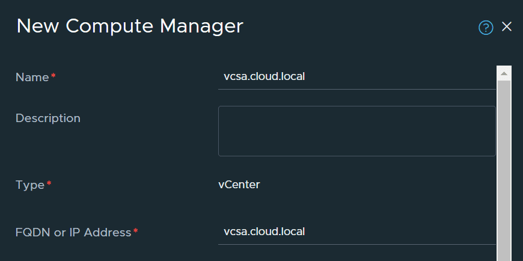

# VMware NSX Plugin

//// warning | Technical Preview

The VMware NSX Plugin is currently only available as alpha version for Technical Preview purposes. It can be used for Demo, POC or lab purposes.

The following features are **not** included in the Technical Preview:

* Connect Audit
* EDA Managed
* Alarms
* Lag support
* NSX certificate support: As a workaround set nsxTlsVerify to false in the NsxPluginInstance

////

## Overview

The NSX plugin enables automated fabric configuration for VMware NSX environments, supporting both **Overlay** and **VLAN segments**. It integrates with EDA Connect to dynamically manage bridge domains and VLANs based on NSX segment definitions.

NSX provides advanced networking capabilities such as:

* L2/L3 overlays using VXLAN or Geneve
* VLAN-based connectivity
* Tier-0 routers for overlay-to-underlay breakout
* Micro-segmentation, load balancing, and VPN services

This plugin focuses on automating fabric configuration for overlay and VLAN segments:

* Automatic provisioning of the fabric based on the configured NSX VLAN segments.
* Automatic provisioning of the fabric based on NSX Transport Node and Host Switch Profile. The Plugin will facilitate the communication between the hypervisors on these Overlay Segments. EDA will not be involved in the actual Overlay traffic in this case.

### Supported Versions

* VMware NSX 4.2

## Architecture

The VMware NSX Plugin consists of two components:

*VMware NSX Plugin App*
: This app runs in EDA and manages the lifecycle of the VMware NSX Plugins. It does so in the standard app model where a custom resource is used
to manage the VMware NSX Plugins.

*VMware NSX Plugin*
: The Plugin itself, which is responsible for connecting and monitoring the VMware NSX environment for changes.

### Supported Features

The following are some of the supported VMware NSX Plugin features:

* CMS-managed integration mode
* EDA-managed integration mode (Not in 25.8)
* VLAN segment Fabric management
* Overlay segment Fabric management

#### Overlay Segments

Overlay segments in NSX are L2 networks encapsulated in L3 using VXLAN or Geneve. The encapsulated traffic is VLAN-tagged and transported via uplinks defined in NSX configurations.

The NSX Plugin will create a `BridgeDomain` and a `VLAN` based on the *Transport VLAN* defined on the *Transport Node* in NSX.

#### VLAN Segments

In NSX it is also still possible to create VLAN segments, the NSX plugin will create the appropriate `BridgeDomain` and `VLAN` in EDA.

## Deployment

/// details | Similarity with VMware vSphere Plugin

Those familiar with the VMware vSphere Plugin will recognize the steps defined here.

///
To deploy the VMware NSX plugin, complete the following tasks:

* Deploy the plugin app.
* Deploy the plugin.

### Connect VMware NSX Plugin App Deployment

The VMware NSX Plugin App is an Application in the EDA App ecosystem. It can be easily installed using the EDA Store UI.

#### Installation using Kubernetes API

If you prefer installing the Plugin using the Kubernetes API, you can do so by creating the following Workflow resource:

/// tab | YAML Resource

```yaml
--8<-- "docs/connect/resources/nsx-appinstall.yaml"
```

///
/// tab | `kubectl apply` command

```bash
kubectl apply -f - <<EOF
--8<-- "docs/connect/resources/nsx-appinstall.yaml"
EOF
```

///

### Connect VMware NSX Plugin Deployment

A prerequisite for creating a `NsxPluginInstance` resource is a `Secret with username and password fields that contain the account information for
an account that can connect to the VMware NSX environment and has read-only access to the cluster so that it can monitor the necessary resources.

/// tab | YAML Resource

```yaml
--8<-- "docs/connect/resources/vmware-secret.yaml"
```

///
/// tab | `kubectl apply` command

```bash
kubectl apply -f - <<EOF
--8<-- "docs/connect/resources/vmware-secret.yaml"
EOF
```

///

/// details | Base64 encoding

Use the following command to base64 encode your username and password:

```bash
echo -n myUsernameOrPassword | base64
```

///

As the VMware NSX Plugins are managed through the operator, you can use the EDA UI to create a new `NsxPluginInstance` resource under the *
*System Administration > Connect > NSX Plugins** menu item.

As an alternative, you can also create the same `NsxPluginInstance` using the following custom resource example. Make sure to replace the specified
values with their relevant content.

A VMware NSX instance can manage multiple VMware vCenter servers, this is reflected by referencing the vCenters and the corresponding Connect VMware Vcenter Plugins in the NsxPluginInstance.

/// details | vCenterFQDN
    type: warning

The vCenterFQDN field has to correspond to the "FQDN or IP Address" field when creating the compute manager.

///
/// tab | YAML Resource

```yaml
--8<-- "docs/connect/resources/nsx-plugin-instance.yaml"
```

///
/// tab | `kubectl apply` command

```bash
kubectl apply -f - <<EOF
--8<-- "docs/connect/resources/nsx-plugin-instance.yaml"
EOF
```

///

The plugin name and external ID must comply with the regex check of `'([A-Za-z0-9][-A-Za-z0-9_.]*)?[A-Za-z0-9]'` and can only contain alphanumerical
characters and `.`, `_` and `-`. It must start with an alphanumerical character.

## Functionality

### Startup

When the plugin is started, the following actions are taken by the plugin:

* The plugin registers itself with Connect, based on the provided `externalID`. If a matching `ConnectPlugin` pre-exists, it is reused.
* The plugin performs an audit: Any Connect-related state that was programmed in NSX while the plugin was not running is synchronized with
  Connect.

### Polling Loop

The plugin will connect to a VMware NSX environment and poll for changes. The plugin will configure Connect and EDA based on the configuration in NSX.

### vCenter Plugin dependency

While NSX is used for defining overlay networking, vCenter is still used to configure the compute hosts and VMs. The NSX Plugin has a dependency on one or more VMware vCenter Plugins for the creation of the ConnectInterface objects in EDA.

### Operational Modes

The technical preview of the NSX plugin only supports NSX Managed Mode.

*NSX Managed Mode*
: Also referred to as *Connect Managed*. When using this mode, the plugin will create a unique `BridgeDomain` for each VLAN segment and to facilitate overlay segment communication between the hypervisors.

## Troubleshooting

/// details | Technical preview
    type: warning
The Technical Preview in 25.8 will not support Alarms. Please consult the logs of the NSX Plugin pod for troubleshooting.
///

### The plugin is not running

If an incorrect NSX hostname or IP is configured in the `NsxPluginInstance` resource, the plugin will try to connect for 3 minutes and
log an error if it fails to connect. To retry the Plugin can be restarted. In case the credentials are incorrect, the plugin will crash/restart immediately.

[//]: # (TODO&#40;Tom&#41; Re-add these once the Plugin supports alarms)
[//]: # (* Check the raised plugin alarms.)
* Check the connectivity from the EDA cluster to NSX.
* Verify the credentials for NSX.
* Check the logs of the plugin pod.

### The plugin is not creating any resources in EDA

[//]: # (* Check the raised plugin alarms.)
* Check the connectivity from the EDA cluster to NSX.
* Check the logs of the plugin pod.
* Check the Plugin staleness state field and verify heartbeats are being updated.
* Check the NSXPluginInstance has valid values
