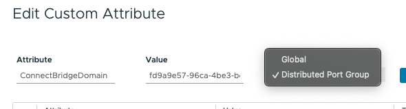

# VMware vSphere Plugin

## Overview

The VMware vSphere plugin leverages the VMware vSphere distributed vSwitch architecture to support managing the fabric directly from VMware vCenter
and make the fabric respond to the networking needs of the environment.

It provides the following capabilities:

* Direct integration into the network management workflow of VMware vCenter.
* The use of the common distributed vSwitches and port groups for both regular virtual machine NICs as well as SR-IOV use cases.
* Support for both untagged and single vlan port groups.
* Automatic provisioning of the fabric based on where the virtual machines need the connectivity.
* Support advanced workflows through EDA, including for VNF use cases with features like QoS, ACLs, and BGP PE-CE ([EDA Managed](#operational-modes))
* Interconnectivity between different cloud environments, allowing for flexible network configurations.
* LAG/LACP interfaces
* Audits

### Supported Versions

* VMware vSphere 8

## Architecture

The VMware vSphere plugin consists of two components:

*VMware vSphere Plugin App*
: This app runs in EDA and manages the lifecycle of the VMware vSphere plugins. It does so in the standard app model where a custom resource is used
to manage the VMware vSphere plugins.

*VMware vSphere Plugin*
: The plugin itself, which is responsible for connecting and monitoring the VMware vCenter environment for changes. The plugin will listen to the
[events](#event-monitoring) of the following objects:

    * Distributed vSwitch (dvS)
    * Distributed Port Groups (dvPG)
    * Host to dvS associations
    * Custom attributes

## Installation

For detailed deployment instructions, see the [VMware vSphere Plugin Installation Guide](vmware-plugin-installation.md).

## Features

### Limitations

* VM Nics in Trunked mode are not supported

### Operational Modes

The plugin supports the following operational modes; these modes can be used simultaneously:

*VMware-Managed Mode*
: Also referred to as *Connect Managed*. When using this mode, the plugin will create a unique `BridgeDomain` and `VLAN` resource for each VLAN 
tagged dvPG in the VMware
vCenter environment.

*EDA-Managed Mode*
: In EDA-managed mode, a dvPG is given a special custom attribute that refers to an existing EDA `BridgeDomain` resource. When the plugin detects 
this custom attribute, and it refers to an existing `BridgeDomain` resource in EDA, it will not create a new `BridgeDomain` but instead will 
associate the dvPG with the
existing one. This allows for more advanced configuration of the application networks.

#### Using EDA-Managed Mode

To use the EDA-managed mode follow these steps:

1. Create a `BridgeDomain` in EDA with the desired settings
2. When creating a distributed Port Group in vCenter, configure a Custom Attribute called `ConnectBridgeDomain` and set its value to the name of the EDA
   `BridgeDomain`.

/// note | Case Sensitivity
Both the key of the Custom Attribute and the value are case-sensitive
///

/// details | Global vs Distributed Port Group type of Custom Attribute
    type: warning

Make sure to create a Custom Attribute of type *Distributed Port Group* on the Port Group.

///

You can configure multiple dvPGs with the same `BridgeDomain`.

You can switch between EDA-managed and VMware-managed mode at any time. You can switch back to VMware-managed mode by setting the
`ConnectBridgeDomain` Custom Attribute to `none`, or by deleting the Custom Attribute entirely.

/// details | Switching between EDA-managed and VMware-managed mode
    type: warning

When switching between the two available modes, connectivity will be temporarily disrupted while the plugin reconfigures the resources in EDA.
///

### Event Monitoring

A plugin will connect to a VMware vCenter environment and subscribe to VMware events. The plugin will configure Connect and EDA based on the events it
receives:

| **Event Trigger**                         | Custom Resource    | Purpose                                                                                                                                                       |
|-------------------------------------------|--------------------|---------------------------------------------------------------------------------------------------------------------------------------------------------------|
| VLAN-tagged distributed PortGroup events  | `BridgeDomain`     | In VMware-managed mode, each dvPG will result in its own unique `BridgeDomain`.                                                                               |
| VLAN-tagged distributed PortGroup events  | `VLAN`             | Each dvPG with a specific VLAN tag will have an EDA `VLAN` resource so it can be attached to the `BridgeDomain`.                                              |
| Host NIC distributed Switch Uplink events | `ConnectInterface` | Each host NIC that gets added as an uplink to a dvS will trigger the creation of a `ConnectInterface`, which is mapped by Connect Core to an EDA `Interface`. |

/// warning | Naming limitations
The uplink names must comply with the regex check of `^[a-zA-Z0-9][a-zA-Z0-9._-]*[a-zA-Z0-9]$`. It can only contain alpha-numerical characters and
` `(space), `.`, `_`, and `-`. It must also have a length of 30 characters or fewer.
///

### Startup

When the plugin is started, the following actions are taken by the plugin:

* The plugin registers itself with Connect, based on the provided `externalID`. If a matching `ConnectPlugin` pre-exists, it is reused.
* The plugin performs an audit: Any Connect-related state that was programmed in vCenter while the plugin was not running is synchronized with
  Connect.

/// details | Plugin externalID is immutable
    type: warning

    Note that the `externalID` of the plugin instance is immutable once created. If you do change it a second plugin instance will be created instead.
    To recover from this situation, delete the incorrectly created `ConnectPlugin`, `BridgeDomain`, `VLAN` and `ConnectInterface` resources.
///

### Heartbeat

The plugin implements a heartbeat mechanism, polling Connect at a regular interval (configured by `heartbeatInterval`). This ensures the plugin's health and timely processing of actionable events from Connect.

### Operator Initiated Audit

In addition to the startup audit, users can initiate an [audit](./audit.md) manually. The audit object contains the status and results, including any discrepancies found between NSX and Connect.

### LLDP

Cloud Connect uses LLDP to discover which VMware hypervisors are running on which switches in EDA. Make sure you enable at least "advertise" LLDP in
the Discovery protocol settings of the distributed vSwitch.

## Troubleshooting

### The plugin is not running

If an incorrect vCenter hostname or IP is configured in the `VmwarePluginInstance` resource, the plugin will try to connect for 3 minutes and
crash and restart if it fails to connect. In case the credentials are incorrect, the plugin will crash and restart immediately.

* Check the raised plugin alarms.
* Check the connectivity from the EDA cluster to vCenter.
* Verify the credentials for vCenter. Make sure to check the base64 encoding of the Secret.
* Check the logs of the plugin pod.

### The plugin is not creating any resources in EDA

* Check the raised plugin alarms.
* Check the connectivity from the EDA cluster to vCenter.
* Check the logs of the plugin pod.
* Check the Plugin staleness state field and verify heartbeats are being updated.
* Try an [operator-initiated audit](#operator-initiated-audit) and check the audit results.

### The plugin is not configuring the correct state

* Check the raised plugin alarms.
* Verify the Uplinks for the dvPG in vCenter are configured as active or standby. If there are no active or standby Uplinks configured, the plugin
  will not associate any `ConnectInterface` with the `VLAN`.
* Uplink names can only contain alpha-numerical characters and `.`, `_`, `-` and must have a length of 30 characters or less.
* VLAN ranges are not supported on dvPGs.
* Inspect the EDA resources, like `VLAN`, `BridgeDomain` and `ConnectInterface`.
* Check the logs of the plugin pod.
* Make sure the LLDP settings are correctly configured on all distributed vSwitches.
